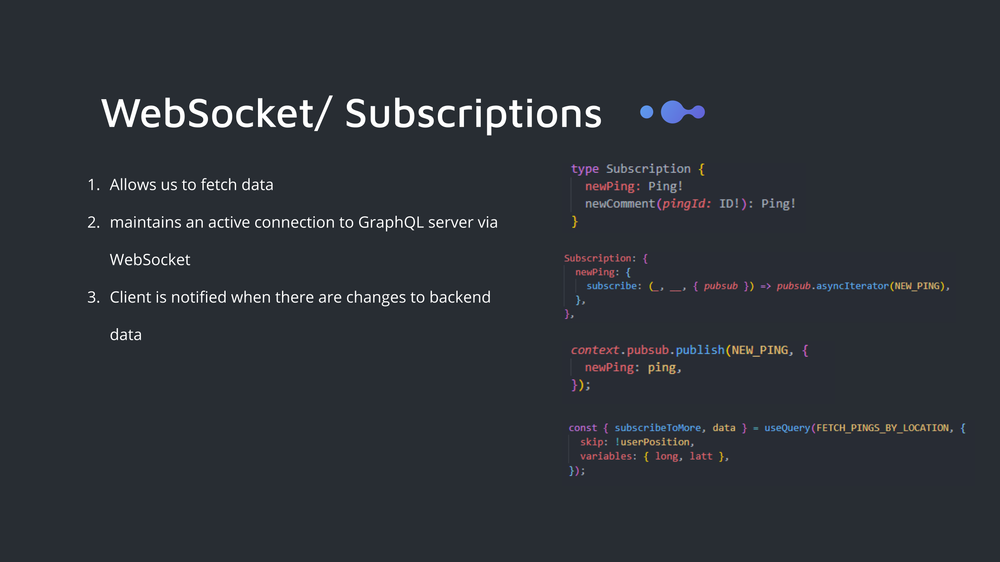
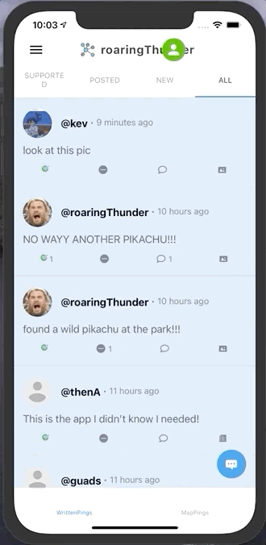

# Ping
[](https://opensource.org/licenses/MIT)


## Description
[https://ping-it.netlify.app](https://ping-it.netlify.app/)

Ping is an app that allows users to see posts from others in the area. Our aim is to aid the community by keeping users informed of local events. Users post information about things happening around them to create a web of real-time event announcements. Pings are automatically deleted after 24 hours to keep the information fresh.

### Technologies Used
```
- apollo-server           - react-router-dom            
- graphQL                 - react-navigation
- bcrypt                  - mapView
- mongoose                - websockets
- react.js                - webfontloader
- mapBox                  - JWT
- apollo-client           - expo-location
- expo                    - async storage
- react-native-elements   - react-native-svg
```

## Table of Contents

* [Installation](#Installation)
* [Usage](#Usage)
* [License](#License)
* [Contributing](#Contributing)
* [Tests](#Tests)
* [Questions](#Questions)

## Code
### Models

For our database, we only had two models, a ping model and a user model, and I wanted to highlight some things on the ping model. A core idea behind our app was keeping information fresh, and we liked the idea of pings being automatically deleted after 24 hours. To do that we set an expires property in our createdAt field which deletes the ping after 24 hours. 
We also thought it'd be nice to have options for which pings you want displayed. For instance maybe you wanted to see the pings you've posted, or only those that you've supported/liked. To help us accomplish this we referenced the User model in our Ping model which allowed us to include information about the user who posted a ping and info about users who supported/liked the ping.

### Websockets

To provide some perspective, RESTful APIs use HTTP for their request/response communication. When a client makes a request to an endpoint, a channel of communication is opened between the client and server, which closes once the response is sent. With subscriptions, the communication isn't done over HTTP, it's done over something called websockets. Websockets allow a client to create a communication channel with the server and keep it open. The benefit of this is that the client can now "subscribe" to or listen for certain events that occur on the server-side. The client will then update it's components when that event occurs. 
In this example, we created a subscription for creating new pings. When a new ping is created, which is the event we're listening for, the client will instantly know about it and will receive the new ping information real-time due to the open connection. This means that when a user creates a new ping, another user on a separate device will have that ping show up on their screen without needing to refresh the page


### React-Navigation

One of the main differences between React and React-Native was the navigation aspect. In React-Native, there are several types of navigation methods, namely, Stack, Drawer, Bottom Tab, and Top Tab Navigation. The cool thing about these navigation methods is that you can nest them within each other. To achieve the result in the gif above, we nested the Top Tab Navigator within a Stack Navigator, which was nested within a Bottom Tab Navigator. The Bottom Tab Navigator, along with a separate Stack Navigator was further nested in a Drawer Navigator.


## License
Licensed under the [MIT](https://opensource.org/licenses/MIT) License.

## Contributing
[Server code repo](https://github.com/kev-luo/ping-server)
[Mobile code repo](https://github.com/kev-luo/ping-mobile)
[Original repo before server/client code split](https://github.com/kev-luo/ping)

## Questions
* [kvn.luo@gmail.com](kvn.luo@gmail.com)
