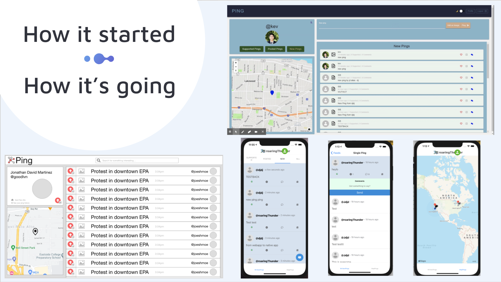
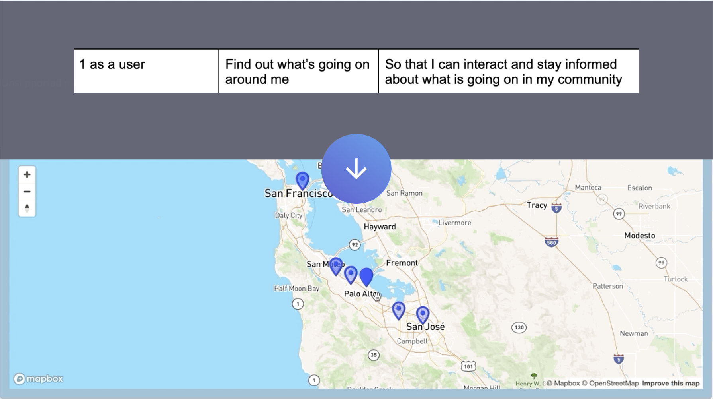
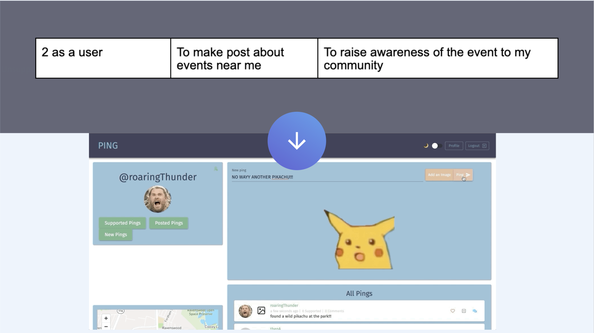
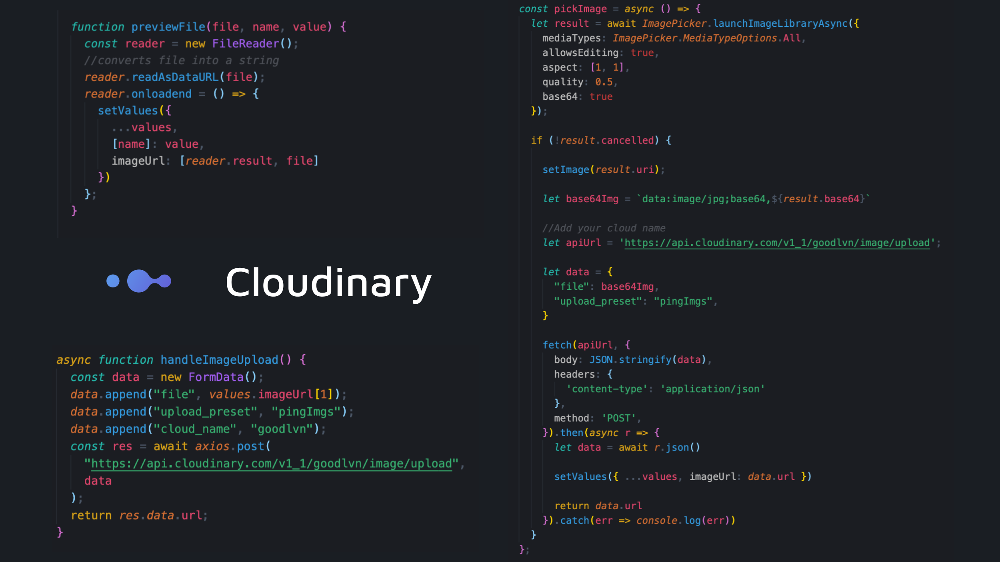
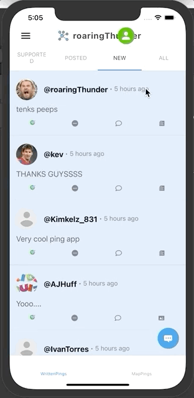

# Ping

[](https://opensource.org/licenses/MIT) 

## Description

### Ping is an app that allows users to see posts from others in the area. The idea is to keep users aware of events happening around them.

[https://ping-it.netlify.app](https://ping-it.netlify.app/)

Ping is an app that allows users to see posts from others in the area. Our aim is to aid the community by keeping users informed of local events. Users post information about things happening around them to create a web of real-time event announcements. Pings are automatically deleted after 24 hours to keep the information fresh.


### Technologies Used

```
- apollo-server           - react-router-dom
- graphQL                 - react-navigation
- bcrypt                  - mapView
- mongoose                - websockets
- react.js                - webfontloader
- mapBox                  - JWT
- apollo-client           - expo-location
- expo                    - async storage
- react-native-elements   - react-native-svg
```

## Table of Contents

- [Installation](#Installation)
- [Wire Frames](#Wire-Frames)
- [User Stories](#User-Stories)
- [Models](#Models)
- [Websockets](#Websockets)
- [Cloudinary](#Cloudinary)
- [Location](#Location)
- [React Native/Expo](#React-Native/Expo)
- [React-Navigation](#React-Navigation)
- [License](#License)
- [Contributing](#Contributing)
- [Questions](#Questions)

## Installation

    npm install

## Wire Frames



## User Stories

Below are some of the user stories that we defined before starting on the actual build of the project.

<table>
    <tr>
        <td>
            
        </td>
        <td>
            
        </td>
    </tr>
</table>

### Models


For our database, we only had two models, a ping model and a user model, and I wanted to highlight some things on the ping model. A core idea behind our app was keeping information fresh, and we liked the idea of pings being automatically deleted after 24 hours. To do that we set an expires property in our createdAt field which deletes the ping after 24 hours.
We also thought it'd be nice to have options for which pings you want displayed. For instance maybe you wanted to see the pings you've posted, or only those that you've supported/liked. To help us accomplish this we referenced the User model in our Ping model which allowed us to include information about the user who posted a ping and info about users who supported/liked the ping.

### Websockets


To provide some perspective, RESTful APIs use HTTP for their request/response communication. When a client makes a request to an endpoint, a channel of communication is opened between the client and server, which closes once the response is sent. With subscriptions, the communication isn't done over HTTP, it's done over something called websockets. Websockets allow a client to create a communication channel with the server and keep it open. The benefit of this is that the client can now "subscribe" to or listen for certain events that occur on the server-side. The client will then update it's components when that event occurs.
In this example, we created a subscription for creating new pings. When a new ping is created, which is the event we're listening for, the client will instantly know about it and will receive the new ping information real-time due to the open connection. This means that when a user creates a new ping, another user on a separate device will have that ping show up on their screen without needing to refresh the page


### Cloudinary

In order to allow the user the functionalty to upload photos for both their profile picture and any new pings they create. It's a straight forward api to use in that all you have to do is send the file you would like to store in cloudinary and they return an object that has a link you can use. We can then refer to the image as that given url to display the to the user. Although cloudinary provides the url for the image we had to break the image down into a url that we can use to display the image to the user before uploading it to cloudinary. This was for the purpose of previewing the image so the user can make sure its the image they want to upload.




### Location

Location was also a fairly straight forward feature to implement. It was really cool to write code that comunicates to the local system. In our web app we used the browsers in built "geolocation" services to request the location of the user. In our react native app we used the the devices location services to request access. One thing that we did in our native app that we will also implement into our web app is to inform the user that the app will not work unless they allow the location services. Once we had the users location we simply saved it as part of the user state we were keeping track of. When it came to getting drag and drop functionality for the maps we had to make sure that the view port was also keeping track of its own state that way it can react (_pun intended_) to the user interaction!


### React Native/Expo

What is React Native?? Well it's a frame work that allows you to write code in javascript and jsx which it then compiles into either typescript/objective C (for IOS) or Java/Kotlin (for Android). That means if you have never built an app but have some experience with react you can give it a shot too!!! That's what we did and using expo made it all that much easier. With the Expo framework that works on top of react native you dont have to worry about any code not configuring to Andriod or IOS. Although there is less flexibility you can be sure that it will work on both device types!

<table>
    <tr>
        <td>
            
        </td>
        <td>
            
        </td>
        <td>
            
        </td>
    </tr>
</table>

React Native was really fun to dive into! There is not doubt that it't tough if you have never had any app building experience but luckily it has a similar flow and structure to react! We were able to jump in there, learn about some styling frameworks as platform to build the rest of our app!

### React-Navigation

One of the main differences between React and React-Native was the navigation aspect. In React-Native, there are several types of navigation methods, namely, Stack, Drawer, Bottom Tab, and Top Tab Navigation. The cool thing about these navigation methods is that you can nest them within each other. To achieve the result in the gif above, we nested the Top Tab Navigator within a Stack Navigator, which was nested within a Bottom Tab Navigator. The Bottom Tab Navigator, along with a separate Stack Navigator was further nested in a Drawer Navigator.


## License

Licensed under the [MIT](https://opensource.org/licenses/MIT) License.

## Contributing

- [Server code repo](https://github.com/kev-luo/ping-server)
- [Mobile code repo](https://github.com/kev-luo/ping-mobile)
- [Original repo before server/client code split](https://github.com/kev-luo/ping)

## Questions

- Kevin Luo
  - [LinkedIn](https://www.linkedin.com/in/kevinluo49/)
  - [Email](kvn.luo@gmail.com)
- JD Martinez
  - [LinkedIn](https://www.linkedin.com/in/jonathan-martinez-316406113/)
  - [Email](focus4ursoul@gmail.com)